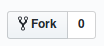

# HelloWorld

## What is Hacktoberfest?

Hacktoberfest is a program by Digitial Ocean and Github. The goal is to submit 5 seperate pull request and at the end of the whole ordeal you get a ```FREE``` T-shirt.

## Steps to follow

### 1) Register for Hacktoberfest

follow this [link](https://hacktoberfest.digitalocean.com/) and register.

### 2) Fork it 

You can get own fork/copy of this reposity by clocking the fork button 

### 3) Add a Program in any langauge you like

Once you have a forked repository; create a folder with the language you want to program. Create a small program around hello world. You can be creative with this and do whatever you like. The more crazy the better!!!!

### 3) Create a PR

After you made your hello world program send a PR to the [UXSoc/hello-world](https://github.com/UXSoc/hello-world).


